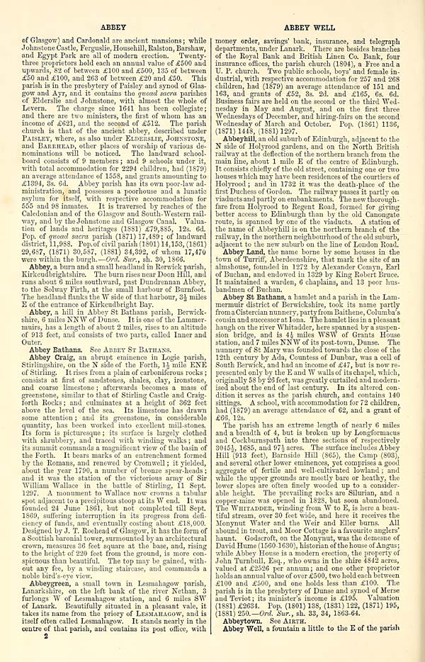
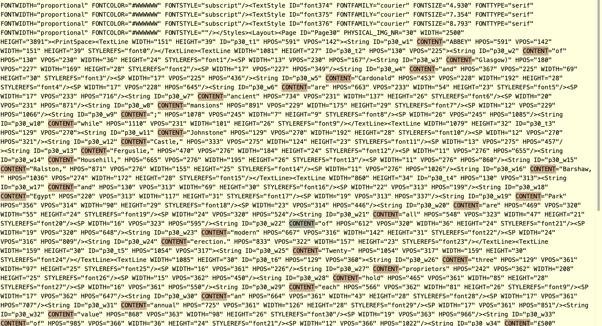

# 🗺️ MappingChange

## Tracking the Evolution of Place Descriptions in the Gazetteers of Scotland (1803–1901)
This repository supports a research project to transform [The Gazetteers of Scotland (1803–1901)](https://data.nls.uk/data/digitised-collections/gazetteers-of-scotland/), digitized by the National Library of Scotland (NLS), into structured article-level data. These gazetteers provide detailed historical accounts of Scottish places—towns, glens, castles, and parishes—captured across 19 volumes (10 editions):
  


The goal is to extract these entries from OCR-based page-level text and convert them into cleaned, deduplicated article records to populate a temporal and semantic knowledge graphs. This work (and its new resource) has been integrated in the [Frances platform](http://www.frances-ai.com), our AI-driven platform for historical text analysis, enabling rich visualizations and advanced NLP-driven analysis of Scotland’s historical landscape.


## 📖 Cite This Resource

If you use this dataset, pipeline, or knowledge graph in your work, please cite:

Yu, L., & Filgueira, R. (2025). MappingChange: A Temporal and Semantic Knowledge Base of the Scottish Gazetteers (1803–1901). Zenodo. https://doi.org/10.5281/zenodo.15397756


## 🎯 Contribution Summary

This resource contributes:
- Article-level dataframes ( individual and aggregated) extracted from 19th-century Scottish Gazetteers
- A reproducible pipeline for semantic enrichment and temporal modeling of historical place descriptions
- Three interlinked Knowledge graphs aligned with [HTO
ontology](https://w3id.org/hto) linking Gazetteer entries to external sources (Wikidata, DBpedia)
- Notebooks an usage examples of this resource powered by SPARQL and Dataframes 
- Search indexes powered by ElasticSearch 

This pipeline uniquely leverages GPT-4 for structured article segmentation across noisy OCR editions, overcoming variability in historical formatting. This is the first semantically enriched and temporally aligned resource of its kind over this corpus.


## 📦 Resource Availability Statement

- **Code Repository**: [GitHub – francesNLP/MappingChange](https://github.com/francesNLP/MappingChange)  
- **Archived Release**: [Zenodo DOI](https://doi.org/10.5281/zenodo.15393936)  
- **License**: [MIT](./LICENSE) 
- **Ontology**: [Heritage Textual Ontology (HTO)](http://query.frances-ai.com/hto_gazetteers) ([code](https://github.com/frances-ai/HeritageTextOntology?tab=readme-ov-file)) — semantic model used throughout the KsG  
- **Main Input Dataset**: [`gazetteers_dataframe`](https://drive.google.com/file/d/1J6TxdKImw2rNgmdUBN19h202gl-iYupn/view?usp=share_link) — page-level OCR + metadata structured dataframe derived from [Zenodo](https://zenodo.org/records/14051678)  
- **Derived Data Outputs**: Cleaned article-level DataFrames, RDF triples, enriched KG — see [Extracted DataFrames](#dataframes-with-extracted-articles) and [KGs with Extracted Articles](#kgs-with-extracted-articles)  
- **SPARQL Endpoint**:  http://query.frances-ai.com/hto_gazetteers - You can use it programmatically, see our [Notebooks](./Notebooks) (and the python code bellow). 
- **Execution Instructions**: [📄 `PIPELINE_EXECUTION.md`](./PIPELINE_EXECUTION.md) — step-by-step guide for running the full pipeline  
- **Query & Usage Examples**: [📄 `KG_ES_USAGE.md`](./KG_ES_USAGE.md) — how to query the KG and use Elasticsearch indices  
- **Interactive Notebooks**: [📁 `Notebooks/`](./Notebooks) — Colab/Jupyter notebooks for KG exploration and validation ; and DataFrame analysis  
- **Reusability & Extensibility**: All components are modular and documented. See [pipeline scripts](./src), [usage guide](./KG_ES_USAGE.md), and [execution walkthrough](./PIPELINE_EXECUTION.md) for adaptation and reuse.

> ⚠️ **Note**: The SPARQL endpoint at `http://query.frances-ai.com/hto_gazetteers` **does not provide a public web-based user interface**. However, it is fully accessible for programmatic querying — for example, using libraries like [`SPARQLWrapper`](https://rdflib.github.io/sparqlwrapper/), as shown in the code snippet bellow:


```python 
  from SPARQLWrapper import SPARQLWrapper, JSON
  sparql = SPARQLWrapper("http://query.frances-ai.com/hto_gazetteers")
  sparql.setReturnFormat(JSON)
```


## ✅ FAIR Principles Compliance

- **Findable**: Published on GitHub and Zenodo with DOI and persistent identifiers
- **Accessible**: Openly licensed (MIT), full access to code and data
- **Interoperable**: Uses RDF/Turtle (HTO), standard vocabularies (e.g., schema.org, CIDOC-CRM)
- **Reusable**: Modular code, documented pipeline, and detailed walkthroughs support reuse and extension

## 🧱 Components at a Glance

| Component Type         | Description                                                              | Access / Link                                                                                      | Format / Type                  |
|------------------------|--------------------------------------------------------------------------|-----------------------------------------------------------------------------------------------------|-------------------------------|
| 🗃️ Input Dataset        | OCR-based Gazetteer pages with metadata (`gazetteers_dataframe`)          | [Zenodo](https://zenodo.org/records/14051678)                                                       | JSON (page-level)             |
| 🛠️ Pipeline Scripts     | Article segmentation, merging, KG generation, enrichment                 | [`/src`](./src), [Pipeline Guide](./PIPELINE_EXECUTION.md)                                          | Python scripts                |
| 📘 Ontology             | Heritage Textual Ontology (HTO) for semantic modeling                    | [w3id.org/hto](https://w3id.org/hto), [GitHub](https://github.com/frances-ai/HeritageTextOntology) | RDF / Turtle                     |
| 🧠 Article DataFrames   | Cleaned per-edition and aggregated article-level data                    | [Zenodo](https://doi.org/10.5281/zenodo.15393936), [See full list](#dataframes-with-extracted-articles) | Pandas / JSON                 |
| 🌐 Knowledge Graph      | RDF triples + enrichments (Wikidata, DBpedia, Geo)                        | [Zenodo](https://doi.org/10.5281/zenodo.15393936), [See full list](#kgs-with-extracted-articles)        | RDF/Turtle, SPARQL (Fuseki)  |
| 📊 Notebooks            | Exploratory, validation and comparative analysis of KGs and DataFrames               | [`/Notebooks`](./Notebooks)                                                                         | Jupyter (.ipynb)              |
| 🔎 Search Indexes       | Full-text + semantic search via Elasticsearch (SPARQL + REST access)      | [Frances Platform](http://www.frances-ai.com), [Usage Guide](./KG_ES_USAGE.md)                      | Elasticsearch / JSON / SPARQL |

## 🔍 From Unstructured Text to Structured Knowledge

**MappingChange** addresses a core challenge in historical NLP and Semantic Web research:  
**transforming noisy, unstructured OCR data into coherent, article-level structured content.**

The *Gazetteers of Scotland* were digitized as **page-level XML files** (as free-text at the page level), lacking article layout markers, section boundaries, or semantic annotations—a common situation in historical corpora, especially those processed via OCR from scanned documents. However, this challenge also applies to **modern born-digital corpora**, where structure is often implicit or inconsistently applied.

This task presents several key challenges:

- 🧩 **Article segmentation is non-trivial**: Articles vary widely in length—from just a few words to multi-page narratives. They often begin mid-column or mid-page and are not clearly separated from surrounding text.

- ⚡️ **No clear boundary between content and metadata**: Page numbers, running titles, and section headers appear in the same OCR layer as article content, making it difficult to isolate meaningful segments with rule-based methods.

- 🔭 **Place name ambiguity**: Many locations share the same name (e.g., “Abbey” — see [Pages 1 and 2 of the 1884 edition](https://github.com/francesNLP/MappingChange?tab=readme-ov-file#%EF%B8%8F-ocr-page-level-format)) but refer to different places, even within the same edition. In some cases, headers may include full place names, making it difficult to distinguish between article titles, section headings, or continuations. Determining whether a place name marks the start of a new article, a header, or a continuation from a previous page—and whether two same-named entries describe the *same* or *different* places—requires contextual understanding of layout, content flow, and semantic cues.

- 📉 **Changing coverage across editions**: Not all places appear in every edition. Some entries are added in later editions (e.g., due to industrial development or administrative changes), while others are shortened, renamed, or removed altogether. This drift in coverage complicates direct alignment and requires flexible matching strategies. Such challenges are common in evolving reference works—e.g., encyclopaedias, dictionaries, geographical catalogues, and bibliographic indexes—where entries are frequently revised between editions.


- 🔍 **Layout inconsistency and OCR noise**: Scan quality, column structure, typography, and OCR performance vary significantly across editions, complicating reliable text segmentation.

- ❌ **Structural limitations of unsegmented corpora**: Without article-level structure, historical collections are often reduced to keyword searches or regex-based filtering, limiting any meaningful semantic modeling or temporal analysis.

> These issues make large-scale semantic modeling infeasible without first extracting coherent, self-contained articles.


### 🖼️ OCR Page-Level Format


*Figure: First page from the 1803 Gazetteer. Articles begin mid-page, vary in length, and include embedded headers and footnotes. Article names are in uppercase, followed by punctuation (e.g., "." or ";"). Long articles may span multiple pages; short entries may be only a few words. Additional name's place can appear in parentheses. Headers are two sets of three uppercase words (e.g., “ABB ABBE”).*


*Figure: First page from the 1884 Gazetteer. This edition uses a denser two-column layout and the first page begins without headers. The title has changed to “Ordnance Gazetteer of Scotland.” Articles can still vary greatly in length. Article names are capitalized, followed by commas, with alternative names sometimes introduced by "or" or included in parentheses. Subsequent pages include headers showing the first and last articles names in uppercase on the page.*


> ⚠️ **Note**: These two examples illustrate typical OCR layouts, but every gazetteer edition differs in format, conventions, and typography. Traditionally, such variation would require crafting edition-specific rule-based parsers—often brittle and hard to generalize. In contrast, **our GPT-4-based approach enables a unified extraction strategy**, where the same logic can be reused across editions with minimal changes (only requiring prompt adjustments). This makes adaptation across formats far easier and adaptative than rule-based methods.


### 📄 Corresponding OCR/XML Structure

Note that article extraction is not performed from the image itself, but from the XML-encoded OCR text. In these XMLs, there is **no distinction** between headers, article content, and footnotes. All text is flattened into a continuous stream of `CONTENT` strings with no structural annotations or layout information.



*Figure: Page 2 of the 1884 edition.*



*Figure: XML representation of OCR output. Note the absence of layout or semantic structure—only positional text content is preserved.*


### 🧠 Strategy and Impact

To overcome these challenges, we use **GPT-4 with a sliding window strategy** to extract article-level entries from noisy OCR streams. This LLM-based method is:

- **Flexible** to formatting variation
- **Layout-aware** due to GPT’s long-context handling
- **Scalable and portable** across editions, unlike brittle rule-based approaches

Once extracted, these articles form the basis for:

- 🧹 Cleaning and normalization  
- 🧠 Semantic enrichment and concept clustering  
- 🔍 Disambiguation of place names  
- 🌐 Knowledge graph construction  

This enables powerful querying, comparative analysis, and integration with external sources like **Wikidata** and **DBpedia**.

Although many of these structural challenges are specific to historical collections, similar issues arise in modern free-text corpora. Once article-level structure is restored, **MappingChange** enables semantic enrichment, SPARQL querying, and diachronic analysis that would otherwise be infeasible.

This approach can be generalized to other gazetteers, encyclopaedias, or born-digital reference works.


## 🧑 Target Users and Use Cases

This resource is designed for:

- Researchers in Digital Humanities and Cultural Heritage
- Semantic Web and NLP scholars studying diachronic corpora
- Developers of search tools and interfaces for historical archives
- Educators teaching semantic enrichment and ontology modeling

It supports use cases such as:
- Semantic comparison of place descriptions across time
- Linking regional gazetteers with global encyclopedic sources
- Querying historical narratives using SPARQL and embeddings


## 🔁 Reuse Potential

The resource supports reuse in:
- Historical and cultural heritage studies (e.g., tracing socio-economic change)
- Knowledge graph construction and ontology design evaluation
- NLP benchmarking for long-form entity extraction and temporal linking
- Geoparsing and semantic search applications

Researchers can easily adapt our modular scripts and ontology to other historical corpora.

## 🧪 Usage Overview

The resources produced by the MappingChange pipeline—cleaned DataFrames and RDF Knowledge Graphs—can be queried, visualized, and analyzed through multiple interfaces. This repository provides two key usage documents:

- [📄 PIPELINE_EXECUTION.md](./PIPELINE_EXECUTION.md): Complete, step-by-step walkthrough for extracting, cleaning, modeling, enriching, and indexing Gazetteer entries. Ideal for reproducing or extending the pipeline.
- [📄 KG_ES_USAGE.md](./KG_ES_USAGE.md): Focused usage guide with SPARQL query examples and Elasticsearch index access patterns. Shows how to explore the deployed Knowledge Graph and ES indices.

See also the [📓 Notebooks](./Notebooks) for additional worked examples, data exploration, and comparative analysis.


## ⚙️ Setup Instructions

```bash
conda create -n gazetteer_env python=3.11 -y
conda activate gazetteer_env
pip install -r requirements.txt
```

Required:

- OpenAI API key
- Fuseki + Elasticsearch server credentials
- Base dataframe at page-level: [gazetteers_dataframe](https://drive.google.com/file/d/1J6TxdKImw2rNgmdUBN19h202gl-iYupn/view?usp=share_link)
- Countries KG
- Edinburgh Geoparser


## 📚 Overview and Pipeline

This repository implements a modular pipeline for transforming the [Gazetteers of Scotland (1803–1901)](https://data.nls.uk/data/digitised-collections/gazetteers-of-scotland/)—spanning 19 volumes across 10 historical editions—into a semantically enriched, article-level knowledge graph.

We begin with the previously released [`gazetteers_dataframe`](https://zenodo.org/records/14051678), which contains OCR-extracted text and metadata at the **page level**. Using large language models (GPT-4), we segment these pages into **structured article-level entries**, each corresponding to a specific place. This shift from unstructured OCR pages to place-specific records is foundational for enabling semantic enrichment and knowledge graph construction.

> **Note**: This is the first resource to semantically structure 19th-century Scottish Gazetteer content at the article level, supporting both historical research and Linked Data applications.

The resulting entries are cleaned, deduplicated, semantically modeled using the [Heritage Textual Ontology (HTO)](https://w3id.org/hto), and linked across editions, to external sources (e.g., Wikidata, DBpedia), and to geospatial annotations. The output forms a reusable RDF knowledge graph for historical analysis.

<div align="center"> 
  
</div>

### 🔄 Pipeline Components

1. **Article Extraction**: Uses GPT-4 to segment OCR pages into structured entries (per edition).
2. **Cleaning & Deduplication**: Merges outputs, resolves duplicates, and integrates original metadata.
3. **Knowledge Graph Construction**: Converts cleaned entries into RDF using HTO, with redirects and references linked.
4. **Semantic Enrichment**: Adds embeddings, temporal concepts, and links to Wikidata and DBpedia.
5. **Geospatial Annotation**: Uses NER (Stanza) and georesolution (Edinburgh Geoparser) to tag locations.
6. **Indexing**: Publishes data to Elasticsearch for semantic and full-text search in the [Frances platform](http://www.frances-ai.com).

Each step is implemented as a script in the `src/` directory, with well-defined inputs, outputs, and configurations.

## 🚀 Execution Guide

For full setup instructions, script usage, configuration, and SPARQL examples, see:

👉 [📄 PIPELINE_EXECUTION.md](./PIPELINE_EXECUTION.md)

This includes:
- Environment setup
- GPT-based extraction and merging
- Knowledge graph generation and uploading
- Embedding, linking, and enrichment
- Geotagging and spatial queries
- Elasticsearch indexing

## KGs and ES Usage Guide

👉 [📄 KG_ES_USAGE.md](./KG_ES_USAGE.md)


## Dataframes with Extracted Articles

These cleaned, deduplicated DataFrames (as a result of running[dataframe_articles.py](./src/dataframe_articles.py) wich each dataset) are ready for semantic enrichment and visual analysis:

* [dataframe_gaz_1803](https://drive.google.com/file/d/1a4BtLrwyfHb4I6cmAVbaaw-IafWf1dnR/view?usp=share_link)
* [dataframe_gaz_1806](https://drive.google.com/file/d/1ZGt8hKzQ2rvk_-dlVHpn6UwoSkiZyNDO/view?usp=share_link)
* [dataframe_gaz_1825](https://drive.google.com/file/d/1Fsr61JqpV4JND0VKtezbNoVCrdw_Ahi4/view?usp=share_link)
* [dataframe_gaz_1838](https://drive.google.com/file/d/1g5xCuG_eAJp0GQNfDDTpwSK4ndqTz-G_/view?usp=share_link)
* [dataframe_gaz_1842](https://drive.google.com/file/d/1dNJaS9RWHOvP3vsfy5ZDE6SCiVeSiRj_/view?usp=share_link)
* [dataframe_gaz_1846](https://drive.google.com/file/d/1JxGybA-op04Xvs6-MG-C6x1iuneLF5qQ/view?usp=share_link)
* [dataframe_gaz_1868](https://drive.google.com/file/d/1thPWG2LXHvo7owEWOzu_K_B5XZ5znPMO/view?usp=share_link)
* [dataframe_gaz_1882](https://drive.google.com/file/d/1r5DMWfOas_ajS71vrC0Cr4I3oxD6ZLjm/view?usp=share_link)
* [dataframe_gaz_1884](https://drive.google.com/file/d/1EHrlwH5cnZb1QISt_98ZcEpIVP3wIHmt/view?usp=share_link)
* [dataframe_gaz_1901](https://drive.google.com/file/d/1a3Qi0Oj8HzFql0BkPjutaUQx8fSzqy1C/view?usp=share_link)


**Important**: The aggreated dataframe, which also includes embeddings, can be downloaded from here: [`gaz_kg_concepts_df`](https://drive.google.com/file/d/1EyG_Jm5so6bGL6is9Br8eDs5gVutKdQX/view?usp=share_link)

## KGs with Extracted Articles

Here you can find the three KGs with the extracted articles: The first one is the main KG with all the concepts and relations, the second one includes the locations annotations and the third one includes the extra concepts links.

* [gaz.ttl](https://drive.google.com/file/d/1fbpFu8ts7hPOsGAq8SUaiJn6IOZ73zez/view?usp=share_link)
* [gaz_locations_annotations.ttl](https://drive.google.com/file/d/1vnYZEeiLjcfwgkHyJG4l9OECuwtvY1yy/view?usp=share_link)
* [gaz_extra_concepts_links.ttl](https://drive.google.com/file/d/1UeT8v9Avwk0dlqPx_ZD5-IxOFpOgAyX7/view?usp=share_link)


## 📓 Notebooks Exploration

These Jupyter notebooks offer different entry points for exploring the Gazetteers of Scotland dataset, enriched by the MappingChange pipeline:

- [`Exploring_Individual_Gz_Dataframes.ipynb`](./Notebooks/Exploring_Individual_Gz_Dataframes.ipynb): Explores each gazetteer edition separately — useful for comparing formatting, cleaning strategies, and early article-level insights.

- [`Exploring_AggregatedDF.ipynb`](./Notebooks/Exploring_AggregatedDF.ipynb): Main exploratory notebook working with the unified DataFrame (`gaz_kg_concepts_df`). Includes 22 analyses covering article counts, sentiment, keyword trends, embeddings, and semantic change across editions.

- [`Knowledge_Exploration_SPARQL.ipynb`](./Notebooks/Knowledge_Exploration_SPARQL.ipynb):  
  Interacts with the Gazetteers Knowledge Graph via SPARQL to support structured exploration of linked data, references, and ontology-driven relations. *Includes two curated sets of SPARQL queries: one for validating internal consistency (e.g., redirects, references), and another for examining external linkages to sources like Wikidata.*


Each notebook serves a different aspect of the project: data quality, temporal-linguistic analysis, and semantic web querying.


### 📊 Comparative Analyses

The notebook [`Exploring_AggregatedDF.ipynb`](./Notebooks/Exploring_AggregatedDF.ipynb) provides a comprehensive suite of 22 comparative analyses across editions of the Gazetteers. These include trends in article length, sentiment, keyword frequency, semantic similarity, and named entity evolution—offering insights into how place descriptions shift across time.

Below, we showcase just two representative visualizations:

#### 1. Keyword Trends Over Time
A heatmap showing how terms related to religion, gender, industry, education, and governance vary across editions (1803–1901).


#### 2. Article Length Distribution
A boxplot of word counts per article by edition, highlighting editorial and structural variation across volumes.


These examples illustrate the types of diachronic comparisons made possible by the MappingChange pipeline. For a deeper dive into all analyses, see the full [`Exploring_AggregatedDF.ipynb`](./Notebooks/Exploring_AggregatedDF.ipynb).

The full notebook includes the following types of analyses:

- 📊 Article count and length per edition
- 📦 Boxplot of article word counts across years
- 📈 Top longest article by edition
- 🔤 First-letter distribution of article titles
- 🧠 Most frequent adjectives per edition (using SpaCy)
- 🏷️ Most referenced capitalized phrases (place-like terms)
- 🔁 Repeated place names within each edition
- 🔄 Place names reused across multiple editions
- 🧮 Alternate name statistics (redirects and variants)
- 🔗 Reference term usage and density per edition
- 📉 Keyword frequency trends for selected terms (e.g. railway, harbour)
- 📌 Keyword frequency heatmap across ~40 terms (e.g. church, cotton, parliament)
- 🧠 TF-IDF keyword analysis (top distinctive terms per edition)
- 🔍 TF-IDF trend tracking of specific words (e.g. "railway", "church")
- 💬 Sentiment analysis of article texts across editions (VADER)
- 🏙️ Sentiment over time for selected places (e.g. Edinburgh)
- 🌍 Geocoding sample articles using Nominatim + Folium
- 📎 Semantic similarity of articles (using precomputed embeddings)
- 🧭 Ranking places by semantic drift over time
- 🧾 Comparison of article lengths (pages, words) for specific places
- 📝 Historical narrative shifts in key cities (e.g. Glasgow, Edinburgh)
- 📚 Side-by-side text comparisons of places across editions

These analyses help uncover editorial, linguistic, and conceptual changes in how Scottish places were described from 1803 to 1901.


## ✨ Research Context

This work contributes to the [MappingChange initiative](https://rse.org.uk/scotlands-vibrant-research-sector-to-receive-over-705-5k-in-the-latest-rse-research-awards-programme/): building a temporal and semantic knowledge graph of 19th-century Scottish place descriptions. It enables researchers to:

- Analyze the evolution of geographical and cultural narratives
- Compare local descriptions in the Gazetteers with contemporal resources (Wikipedia, DBpedia)
- Link and cluster places across editions and sources using NLP and semantic matching
- The extracted articles are integrated into [Frances](http://www.frances-ai.com).

## ⚠️ Limitations and Disclaimer

This resource is based on OCR-derived historical text and automated extraction pipelines. While the MappingChange system uses robust techniques (including GPT-4, embedding-based enrichment, and georesolution), it is not immune to errors. Specifically:

- Article segmentation may contain occasional boundary or formatting mistakes.
- Disambiguation of identically named places is context-dependent and may misfire in edge cases.
- OCR quality, inconsistent layout, and orthographic variation across editions can introduce noise.

We welcome feedback, corrections, and contributions from the community to help refine and extend the resource over time.

