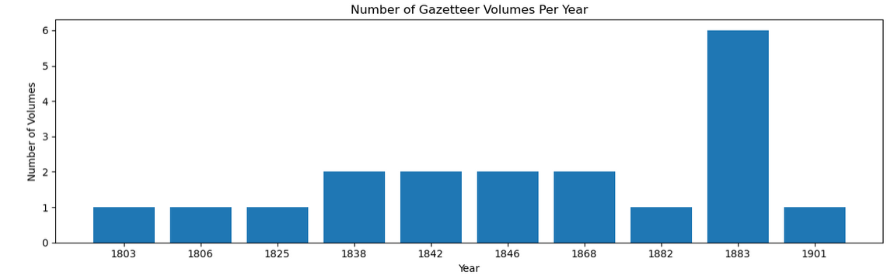
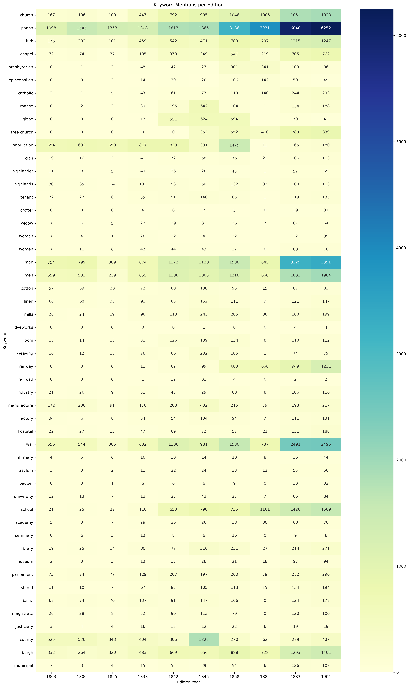
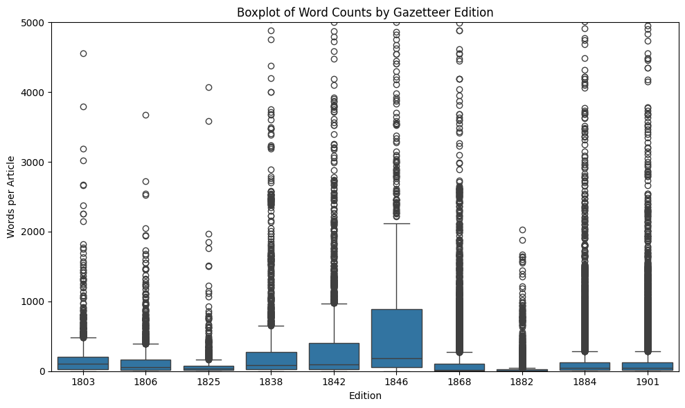

# 🗺️ MappingChange

## Tracking the Evolution of Place Descriptions in the Gazetteers of Scotland (1803–1901)
This repository supports a research project to transform [The Gazetteers of Scotland (1803–1901)](https://data.nls.uk/data/digitised-collections/gazetteers-of-scotland/), digitized by the National Library of Scotland (NLS), into structured article-level data. These gazetteers provide detailed historical accounts of Scottish places—towns, glens, castles, and parishes—captured across 19 volumes (10 editions):
  


The goal is to extract these entries from OCR-based page-level text and convert them into cleaned, deduplicated article records that can eventually populate a temporal and semantic knowledge graph (ScotGaz19-KG). This graph will be integrated into the [Frances platform](http://www.frances-ai.com), enabling rich visualizations and advanced NLP-driven analysis of Scotland’s historical landscape.

This work forms part of the RSE-funded project and builds on prior research funded by the National Library of Scotland.

## 🎯 Contribution Summary

This resource contributes:
- A high-quality, article-level dataset extracted from 19th-century Scottish Gazetteers
- A reproducible pipeline for semantic enrichment and temporal modeling of historical place descriptions
- A knowledge graph aligned with HTO, linking Gazetteer entries to external sources (Wikidata, DBpedia)
- Search and analysis interfaces powered by Elasticsearch and SPARQL

This pipeline uniquely leverages GPT-4 for structured article segmentation across noisy OCR editions, overcoming variability in historical formatting. This is the first semantically enriched and temporally aligned resource of its kind over this corpus.


## 📦 Resource Availability Statement

- **Code repository**: [https://github.com/francesNLP/MappingChange](https://github.com/francesNLP/MappingChange)  
- **Archived version**: [Zenodo DOI](https://doi.org/10.5281/zenodo.XXXXXXX)  
- **License**: MIT License (see [LICENSE](./LICENSE))  
- **Ontology used**: [Heritage Textual Ontology (HTO)](https://w3id.org/hto)  
- **Main input dataset**: [`gazetteers_dataframe`](https://drive.google.com/file/d/1J6TxdKImw2rNgmdUBN19h202gl-iYupn/view?usp=share_link) — the structured **page-level** dataframe extracted from the Gazetteers of Scotland. This was derived from the OCR text and metadata in [this Zenodo record](https://zenodo.org/records/14051678).
- **Derived data**: Article-level DataFrames, RDF knowledge graph, and enriched SPARQL/Elasticsearch outputs are downloadable [here](#dataframes-with-extracted-articles)  
- **SPARQL Endpoint**: Deployable locally with [Apache Jena Fuseki](https://jena.apache.org/documentation/fuseki2/)  
- **Pipeline Execution Guide**: [📄 PIPELINE_EXECUTION.md](https://github.com/francesNLP/MappingChange/blob/main/PIPELINE_EXECUTION.md) — a complete walkthrough for replicating the entire resource  
- **Reusability**: All [scripts](./src/) are modular, reusable, and well-documented. [Notebooks](./Notebooks) provide worked examples and usage guidance.


## ✅ FAIR Principles Compliance

- **Findable**: Published on GitHub and Zenodo with DOI and persistent identifiers
- **Accessible**: Openly licensed (MIT), full access to code and data
- **Interoperable**: Uses RDF/OWL (HTO), standard vocabularies (e.g., schema.org, CIDOC-CRM)
- **Reusable**: Modular code, documented pipeline, and detailed walkthroughs support reuse and extension


## 🧱 Components at a Glance

| Component Type         | Name/Description                                       | Location |
|------------------------|--------------------------------------------------------|----------|
| 🗃 Dataset              | OCR-based Gazetteer pages (gazetteers_dataframe)      | Zenodo   |
| 🛠 Scripts              | Article extraction, merging, RDF conversion, linking  | `/src`   |
| 📘 Ontology            | Heritage Textual Ontology (HTO)                        | w3id.org |
| 🧠 Knowledge Graph     | RDF + semantic enrichment (Wikidata, Geo, Concepts)    | SPARQL   |
| 📊 Visual notebooks    | Colab/Notebook exploratory analyses                    | `/Notebooks` |
| 🔎 Indexes             | Elasticsearch for full-text + semantic search         | Frances  |


## 🧑 Target Users and Use Cases

This resource is designed for:

- Researchers in Digital Humanities and Cultural Heritage
- Semantic Web and NLP scholars studying diachronic corpora
- Developers of search tools and interfaces for historical archives
- Educators teaching semantic enrichment and ontology modeling

It supports use cases such as:
- Semantic comparison of place descriptions across time
- Linking regional gazetteers with global encyclopedic sources
- Querying historical narratives using SPARQL and embeddings


## 🔁 Reuse Potential

The resource supports reuse in:
- Historical and cultural heritage studies (e.g., tracing socio-economic change)
- Knowledge graph construction and ontology design evaluation
- NLP benchmarking for long-form entity extraction and temporal linking
- Geoparsing and semantic search applications

Researchers can easily adapt our modular scripts and ontology to other historical corpora.

## ⚙️ Setup Instructions
```bash
conda create -n gazetteer_env python=3.11 -y
conda activate gazetteer_env
pip install -r requirements.txt
```

Required:

- OpenAI API key
- Fuseki + Elasticsearch server credentials
- Base dataframe at page-level: [gazetteers_dataframe](https://drive.google.com/file/d/1J6TxdKImw2rNgmdUBN19h202gl-iYupn/view?usp=share_link)
- Countries KG
- Edinburgh Geoparser


## 📚 Overview and Pipeline

This repository implements a modular pipeline for transforming the [Gazetteers of Scotland (1803–1901)](https://data.nls.uk/data/digitised-collections/gazetteers-of-scotland/)—spanning 19 volumes across 10 historical editions—into a semantically enriched, article-level knowledge graph.

We begin with the previously released [`gazetteers_dataframe`](https://zenodo.org/records/14051678), which contains OCR-extracted text and metadata at the **page level**. Using large language models (GPT-4), we segment these pages into **structured article-level entries**, each corresponding to a specific place. This shift from unstructured OCR pages to place-specific records is foundational for enabling semantic enrichment and knowledge graph construction.

> **Note**: This is the first resource to semantically structure 19th-century Scottish Gazetteer content at the article level, supporting both historical research and Linked Data applications.

The resulting entries are cleaned, deduplicated, semantically modeled using the [Heritage Textual Ontology (HTO)](https://w3id.org/hto), and linked across editions, to external sources (e.g., Wikidata, DBpedia), and to geospatial annotations. The output forms a reusable RDF knowledge graph for historical analysis.

<div align="center"> 
  
</div>

### 🔄 Pipeline Components

1. **Article Extraction**: Uses GPT-4 to segment OCR pages into structured entries (per edition).
2. **Cleaning & Deduplication**: Merges outputs, resolves duplicates, and integrates original metadata.
3. **Knowledge Graph Construction**: Converts cleaned entries into RDF using HTO, with redirects and references linked.
4. **Semantic Enrichment**: Adds embeddings, temporal concepts, and links to Wikidata and DBpedia.
5. **Geospatial Annotation**: Uses NER (Stanza) and georesolution (Edinburgh Geoparser) to tag locations.
6. **Indexing**: Publishes data to Elasticsearch for semantic and full-text search in the Frances platform.

Each step is implemented as a script in the `src/` directory, with well-defined inputs, outputs, and configurations.

## 🚀 Execution Guide

For full setup instructions, script usage, configuration, and SPARQL examples, see:

👉 [📄 PIPELINE_EXECUTION.md](./PIPELINE_EXECUTION.md)

This includes:
- Environment setup
- GPT-based extraction and merging
- Knowledge graph generation and uploading
- Embedding, linking, and enrichment
- Geotagging and spatial queries
- Elasticsearch indexing


## Dataframes with Extracted Articles

These cleaned, deduplicated DataFrames (as a result of running[dataframe_articles.py](./src/dataframe_articles.py) wich each dataset) are ready for semantic enrichment and visual analysis:

* [dataframe_gaz_1803](https://drive.google.com/file/d/1a4BtLrwyfHb4I6cmAVbaaw-IafWf1dnR/view?usp=share_link)
* [dataframe_gaz_1806](https://drive.google.com/file/d/1ZGt8hKzQ2rvk_-dlVHpn6UwoSkiZyNDO/view?usp=share_link)
* [dataframe_gaz_1825](https://drive.google.com/file/d/1Fsr61JqpV4JND0VKtezbNoVCrdw_Ahi4/view?usp=share_link)
* [dataframe_gaz_1838](https://drive.google.com/file/d/1g5xCuG_eAJp0GQNfDDTpwSK4ndqTz-G_/view?usp=share_link)
* [dataframe_gaz_1842](https://drive.google.com/file/d/1dNJaS9RWHOvP3vsfy5ZDE6SCiVeSiRj_/view?usp=share_link)
* [dataframe_gaz_1846](https://drive.google.com/file/d/1JxGybA-op04Xvs6-MG-C6x1iuneLF5qQ/view?usp=share_link)
* [dataframe_gaz_1868](https://drive.google.com/file/d/1thPWG2LXHvo7owEWOzu_K_B5XZ5znPMO/view?usp=share_link)
* [dataframe_gaz_1882](https://drive.google.com/file/d/1r5DMWfOas_ajS71vrC0Cr4I3oxD6ZLjm/view?usp=share_link)
* [dataframe_gaz_1884](https://drive.google.com/file/d/1EHrlwH5cnZb1QISt_98ZcEpIVP3wIHmt/view?usp=share_link)
* [dataframe_gaz_1901](https://drive.google.com/file/d/1a3Qi0Oj8HzFql0BkPjutaUQx8fSzqy1C/view?usp=share_link)


**Important**: The aggreated dataframe, which also includes embeddings, can be downloaded from here: [`gaz_kg_concepts_df`](https://drive.google.com/file/d/1EyG_Jm5so6bGL6is9Br8eDs5gVutKdQX/view?usp=share_link)


## 📓 Notebooks Exploration

These Jupyter notebooks offer different entry points for exploring the Gazetteers of Scotland dataset, enriched by the MappingChange pipeline:

- [`Exploring_Individual_Gz_Dataframes.ipynb`](./Notebooks/Exploring_Individual_Gz_Dataframes.ipynb): Explores each gazetteer edition separately — useful for comparing formatting, cleaning strategies, and early article-level insights.

- [`Exploring_AggregatedDF.ipynb`](./Notebooks/Exploring_AggregatedDF.ipynb): Main exploratory notebook working with the unified DataFrame (`gaz_kg_concepts_df`). Includes 22 analyses covering article counts, sentiment, keyword trends, embeddings, and semantic change across editions.

- [`Knowledge_Exploration_SPARQL.ipynb`](./Notebooks/Knowledge_Exploration_SPARQL.ipynb):Queries the Gazetteers Knowledge Graph using SPARQL. Enables structured exploration of linked data, references, and ontology-backed relations.

Each notebook serves a different aspect of the project: data quality, temporal-linguistic analysis, and semantic web querying.


### 📊 Comparative Analyses

The notebook [`Exploring_AggregatedDF.ipynb`](./Notebooks/Exploring_AggregatedDF.ipynb) provides a comprehensive suite of 22 comparative analyses across editions of the Gazetteers. These include trends in article length, sentiment, keyword frequency, semantic similarity, and named entity evolution—offering insights into how place descriptions shift across time.

Below, we showcase just two representative visualizations:

#### 1. Keyword Trends Over Time
A heatmap showing how terms related to religion, gender, industry, education, and governance vary across editions (1803–1901).



#### 2. Article Length Distribution
A boxplot of word counts per article by edition, highlighting editorial and structural variation across volumes.



These examples illustrate the types of diachronic comparisons made possible by the MappingChange pipeline. For a deeper dive into all analyses, see the full [`Exploring_AggregatedDF.ipynb`](./Notebooks/Exploring_AggregatedDF.ipynb).

The full notebook includes the following types of analyses:

- 📊 Article count and length per edition
- 📦 Boxplot of article word counts across years
- 📈 Top longest article by edition
- 🔤 First-letter distribution of article titles
- 🧠 Most frequent adjectives per edition (using SpaCy)
- 🏷️ Most referenced capitalized phrases (place-like terms)
- 🔁 Repeated place names within each edition
- 🔄 Place names reused across multiple editions
- 🧮 Alternate name statistics (redirects and variants)
- 🔗 Reference term usage and density per edition
- 📉 Keyword frequency trends for selected terms (e.g. railway, harbour)
- 📌 Keyword frequency heatmap across ~40 terms (e.g. church, cotton, parliament)
- 🧠 TF-IDF keyword analysis (top distinctive terms per edition)
- 🔍 TF-IDF trend tracking of specific words (e.g. "railway", "church")
- 💬 Sentiment analysis of article texts across editions (VADER)
- 🏙️ Sentiment over time for selected places (e.g. Edinburgh)
- 🌍 Geocoding sample articles using Nominatim + Folium
- 📎 Semantic similarity of articles (using precomputed embeddings)
- 🧭 Ranking places by semantic drift over time
- 🧾 Comparison of article lengths (pages, words) for specific places
- 📝 Historical narrative shifts in key cities (e.g. Glasgow, Edinburgh)
- 📚 Side-by-side text comparisons of places across editions

These analyses help uncover editorial, linguistic, and conceptual changes in how Scottish places were described from 1803 to 1901.


## ✨ Research Context

This work contributes to the [MappingChange initiative](https://rse.org.uk/scotlands-vibrant-research-sector-to-receive-over-705-5k-in-the-latest-rse-research-awards-programme/): building a temporal and semantic knowledge graph of 19th-century Scottish place descriptions. It enables researchers to:

- Analyze the evolution of geographical and cultural narratives
- Compare local descriptions in the Gazetteers with national perspectives in the Encyclopaedia Britannica
- Link and cluster places across editions and sources using NLP and semantic matching
- The extracted articles will be integrated into Frances, an AI-driven platform for historical text analysis hosted at the Edinburgh International Data Facility (EIDF).


## 📖 Cite This Resource

If you use this dataset, pipeline, or knowledge graph in your work, please cite:


