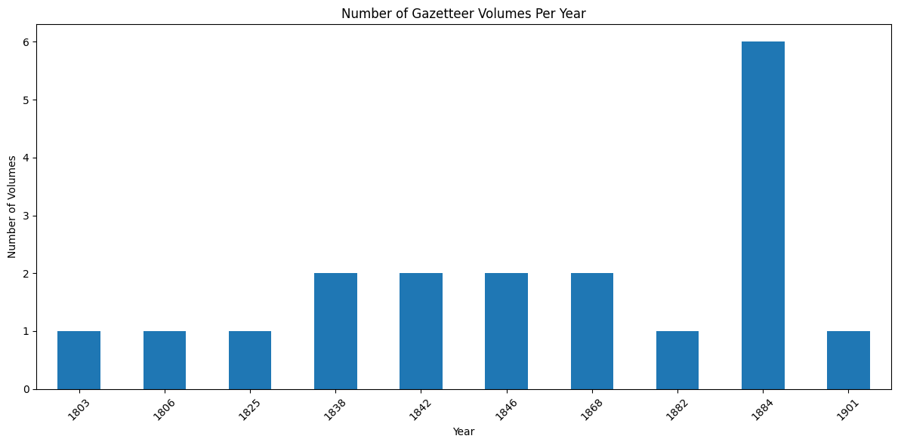

# 🗺️ MappingChange: A Temporal Knowledge Graph of Scottish Gazetteers (1803–1901)

**MappingChange** is a complete, FAIR-compliant resource for transforming the [Gazetteers of Scotland (1803–1901)](https://data.nls.uk/data/digitised-collections/gazetteers-of-scotland/) into a semantically enriched, temporal knowledge graph (ScotGaz19-KG). It includes cleaned article-level datasets, a modular pipeline, and an RDF knowledge graph aligned with [HTO](https://w3id.org/hto).

<div align="center"></div>

## 📦 Resource Availability

- 🔗 Repository: [github.com/francesNLP/MappingChange](https://github.com/francesNLP/MappingChange)
- 📄 Live paper: [rosafilgueira.github.io/MappingChange-Paper-ISWC2025](https://rosafilgueira.github.io/MappingChange-Paper-ISWC2025/)
- 📥 Zenodo Archive: [DOI placeholder](https://doi.org/10.5281/zenodo.XXXXXXX)
- 📚 Ontology: [HTO](https://w3id.org/hto)
- ✨ Platforms: SPARQL endpoint (Fuseki) + Semantic search (Elasticsearch)

## ⚙️ Quick Setup

```bash
conda create -n gazetteer_env python=3.11 -y
conda activate gazetteer_env
pip install -r requirements.txt
```

## 🔁 Workflow Overview


### 📥 Input
- Gazetteers page-level OCR data ([Download](https://drive.google.com/file/d/1J6TxdKImw2rNgmdUBN19h202gl-iYupn/view?usp=share_link))
- Countries knowledge graph ([Zenodo](https://doi.org/10.5281/zenodo.15361108))
- Geoparsing tool (contact us)

### 🧩 Main Stages
1. **Article Extraction** – GPT-4 based segmentation per edition
2. **Data Cleaning** – Deduplication + metadata alignment
3. **Knowledge Graph Construction** – RDF + [HTO](https://w3id.org/hto) + permanent URLs
4. **Semantic Enrichment** – Embeddings, concept alignment, Wikidata/DBpedia links
5. **Geo Enrichment** – Geotagging + Georesolution
6. **Indexing** – Elasticsearch semantic/full-text search

## 📊 Sample Analyses

<details><summary>📈 Keyword and Sentiment Trends (Click to expand)</summary>

#### Keyword Trends


#### Article Length


</details>

See: [`Exploring_AggregatedDF.ipynb`](./Notebooks/Exploring_AggregatedDF.ipynb) for 20+ comparative analyses.

## 📓 Notebooks

| Notebook | Purpose |
|----------|---------|
| `Exploring_Individual_Gz_Dataframes.ipynb` | Cleaning + edition diagnostics |
| `Exploring_AggregatedDF.ipynb` | Comparative + semantic analysis |
| `Knowledge_Exploration_SPARQL.ipynb` | Querying RDF (Fuseki) |

## 🧪 FAIR and Reusability Notes

- ✅ All scripts and datasets publicly available
- ✅ RDF based on HTO, served via SPARQL
- ✅ Elasticsearch supports semantic search
- ✅ Outputs reused in Frances platform
- ✅ Modular + extensible codebase
- ✅ Rich SPARQL templates and data reuse examples

## ✨ Research Context

This RSE-funded project enables diachronic comparison of Scottish places from 1803–1901. Use cases include:
- Tracing cultural + geographic evolution
- Linking Gazetteers to encyclopedic works
- Querying place name changes, sentiments, and semantic drift
- Educational use of geohistorical Linked Data

See the live resource paper for full citations and technical detail:  
👉 [rosafilgueira.github.io/MappingChange-Paper-ISWC2025](https://rosafilgueira.github.io/MappingChange-Paper-ISWC2025/)
