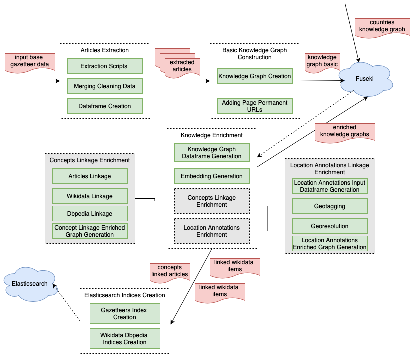

# 🗺️ MappingChange
## Tracking the Evolution of Place Descriptions in the Gazetteers of Scotland (1803–1901)
This repository supports a research project to transform [The Gazetteers of Scotland (1803–1901)](https://data.nls.uk/data/digitised-collections/gazetteers-of-scotland/), digitized by the National Library of Scotland (NLS), into structured article-level data. These gazetteers provide detailed historical accounts of Scottish places—towns, glens, castles, and parishes—captured across 19 volumes:
  


  

The goal is to extract these entries from OCR-based page-level text and convert them into cleaned, deduplicated article records that can eventually populate a temporal and semantic knowledge graph (ScotGaz19-KG). This graph will be integrated into the [Frances platform](http://www.frances-ai.com), enabling rich visualizations and advanced NLP-driven analysis of Scotland’s historical landscape.

This work forms part of the RSE-funded project and builds on prior research funded by the National Library of Scotland.


## Related Publication

This repository supports the ISWC 2025 Resources Track paper:

**Mapping Change: A Temporal Knowledge Graph of Scottish Gazetteers (1803–1901)**  
Authors: Lilin Yu, Rosa Filgueira 
Submitted to: *ISWC 2025 – Resources Track* 
Live paper at: https://rosafilgueira.github.io/MappingChange-Paper-ISWC2025/ 
Persistent Identifier: https://doi.org/10.5281/zenodo.XXXXXXX (if archived)

**_Resource Availability Statement:_**  
All source code, extraction scripts, and pipeline documentation are publicly available at [https://github.com/francesNLP/MappingChange](https://github.com/francesNLP/MappingChange).  

The latest version of the codebase used in this paper has been archived on Zenodo at [https://doi.org/10.5281/zenodo.XXXXXXX](https://doi.org/10.5281/zenodo.XXXXXXX).


## Set Up the Environment
#### Step 1: Create the environment with Python 3.11

```
conda create -n gazetteer_env python=3.11 -y
```
#### Step 2: Activate the environment
```
conda activate gazetteer_env
```

#### Step 3: Install required libraries

```
pip install -r requirements.txt
```

## 📚 Gazetteer Article Extraction 

This repository contains a set of scripts for extracting, processing, and cleaning historical article entries from multiple editions of the Gazetteers of Scotland. These Gazetteers are digitized historical documents structured as page-by-page OCR-extracted text. The aim is to extract individual location-based entries (articles), correct common OCR issues, and resolve duplicates across pages and editions.

The scripts used this repo support:

* Entry-level extraction of articles from OCR-ed pages using GPT-4
* Cleaning and deduplication of overlapping or fragmented entries
* Metadata enrichment from the original XML files (via the dataframe)
* Preparation for integration into a knowledge graph (HTO-compliant)

## 🗂️ Pipeline Overview

We are using the dataframe version of this [KnowledgeGraph](https://zenodo.org/records/14051678) as an input data from our pipeline. If you want to have access to it, drop us an email. 

The figure below shows the overview pipeline, where green blocks represents the tasks listed below the figure.


 1. [Extraction Scripts](#extraction-scripts) ([extract_gaz_1803.py](./src/extract_gaz_1803.py), [extract_gaz_1806.py](./src/extract_gaz_1806.py) ....): 	Main scripts for processing the respective editions. They extract articles from specific page ranges, send chunked prompts to OpenAI’s GPT-4 for article segmentation, and save both raw and cleaned JSON results. Different prompts are used across different scripts, since the format of the books (pages headers, articles names, descriptions) change over years. 

 2. [Merging Cleaning Data](#merging-cleaning-data): Merges all the cleaned JSON article files into a single output file, sorting and aligning metadata across the dataset.

 3. [Dataframe Generation](#dataframe-generation): A script that deduplicates and cleans already extracted articles. It includes advanced logic to detect fuzzy duplicates, substring containment, and prefix-based similarity across multiple pages. It also adds metadata from the original OCR dataset. These are then exported and analyzed in Jupyter/Colab notebooks. Note that if a gazetteer has multiple volumes (e.g. 1838, 1842, etc.) you will need to call an extra script to combine the dataframes generated for each volume in a single one.

 4. [Knowledge Graph Generation](#knowledge-graph-generation): This script constructs a RDF knowledge graph based on [Heritage Textual Ontology (HTO)](https://w3id.org/hto) and all dataframes generated from step 3. In this graph, articles with their "see reference" articles are linked.

 5. [Adding Page Permanent URLs](#adding-page-permanent-urls): Adds permanent url of each page to the graph from step 4. These permanent urls are extracted from [NLS digital gallery](https://digital.nls.uk/gazetteers-of-scotland-1803-1901/archive/97491608) and stored in `volume_page_urls.json`.

 6. [Uploading Knowledge to Fuseki SPARQL Server](#uploading-knowledge-to-fuseki-sparql-server): Upload the graph file from step 5 to a [Fuseki server](https://jena.apache.org/documentation/fuseki2/), a SPARQL server for storing and querying RDF graphs.

 7. [Knowledge Graph Dataframe Generation](#knowledge-graph-dataframe-generation): This script generates dataframe from uploaded graph in step 6. Compare to the dataframe from step 3, this dataframe only stores essential data for knowledge enrichment and retrival in the following steps. It also includes uris of these essential data for enriched knowledge to link to.

 8. [Embedding Generation](#embedding-generation): Generates vector representation (embedding) of each article using their descriptions. These embeddings are used to infer semantic relation and enrich knowledge in the following steps.

 9. [Articles Linkage](#articles-linkage): links articles across years using dataframe from step 8. It groups articles into concepts, and update the input dataframe with concept uris.

 10. [Wikidata Linkage](#wikidata-linkage): links articles with wikidata items using dataframe from step 9. It generates a dataframe for these linked items with uris of their corresponding grouped concepts from step 9.

 11. [Dbpedia Linkage](#dbpedia-linkage): similar to wikidata linkage, this script links articles with dbpedia items using updated input dataframe from step 9.

 12. [Graph Generation for Enriched Knowledge](./src/knowledge_graph/add_concepts_to_graph.py): This script generates graph for enriched knowledge, including grouped concepts, links from articles, wikidata and dbpedia items to concepts. Upload this graph to the same dataset of the server in step 6.

 13. [Elasticsearch Indices Creation](#elasticsearch-indices-creation): create index for gazetteer articles using updated input dataframe from step 9. It creates index for wikidata or dbpedia items using generated items dataframe from step 10 or step 11. 
This elasticsearch server allows both efficient full-text search and semantic search.

All these scripts used are in [src](./src).

## 🚀 Pipeline Execution Walkthrough

This section introduces all the details needed to run the pipeline using scripts mentioned above. In order to follow this guide, you will need to have:

* Required python environment and libraries installed, see [set up environment section](#set-up-the-environment).
* OpenAI API key.
* Fuseki Server hostname, credential (username and password) to login.
* Elasticsearch Server hostname, credential (certificate file, api key) to login.
* Base input dataframe of this collection, drop us an email for access.


Note: We have created a files folder where we place the ouput data, as well as the gazetteers_dataframe (dataframe with all extracted pages text across all gazetteers). 
### Extraction Scripts

**Script**: [extract_gaz_1803.py](./src/extract_gaz_1803.py), [extract_gaz_1806.py](./src/extract_gaz_1806.py) ....

**Input**: `src/files/gazatteers_dataframe` (json format): the base input dataframe of this collection, includes metadata and page level texts.

**Configuration**: 

```python
client = OpenAI(api_key="XXX") # change the api_key
```

**Execution**:
```shell
cd src
mkdir files/1803
mkdir files/1803/main
# take extract_gaz_1803.py for example
python extract_gaz_1803.py
# you need to run other extract_gaz_*.py scripts
```

**Output**: 
* A list of `src/files/1803/raw_extracted_articles_*_*.json` (json format): raw article segmentation result for various page ranges.
* A list of `src/files/1803/cleaned_articles_*_*.json` (json format): cleaned article segmentation result for various page ranges.


### Merging Cleaning Data

**Script**: [merge_cleaned_articles.py](./src/merge_cleaned_articles.py)

**Input**: A list of `src/files/1803/cleaned_articles_*_*.json` (json format): cleaned article segmentation result for various page ranges (from [Extraction Scripts](#extraction-scripts)).


**Configuration**: 

```python
INPUT_DIR = "./1803/json_final/" # Set your input directory of cleaned article segmentation json files
OUTPUT_FILE = "./1803/gazetteer_articles_merged_1803.json" # Set your output filepath
```

**Execution**:
```shell
cd src
mkdir 1803/json_final
cp files/1803/cleaned_articles* 1803/json_final
python merge_cleaned_articles.py
# You need change the INPUT_DIR and OUTPUT_FILE in the script for each different input folder, 
# and rerun this script
```

**Output**: 
* `src/files/1803/gazetteer_articles_merged_1803.json` (json format): merged results of all cleaned articles in the given input folder.


### Dataframe Generation

**Script**: [dataframe_articles.py](./src/dataframe_articles.py)

**Input**:
* `src/files/gazatteers_dataframe` (json format): the base input dataframe of this collection, includes metadata and page level texts.
* `src/files/1803/gazetteer_articles_merged_1803.json` (json format): merged results of all cleaned articles in the given folder.

**Configuration**:

```python
client = OpenAI(api_key="XXX")  # change the api_key
...... 
json_path = "1803/gazetteer_articles_merged_1803.json" # change to the filepath of your merged articles result
......
g_df_fix.to_json(r'1803/gaz_dataframe_1803', orient="index") # change to the filepath for the result
```

**Execution**:
```shell
cd src
python dataframe_articles.py
# You need change the json_path and to_json output path in the script for each different input folder, 
# and rerun this script
```

**Output**: `src/files/1825/gaz_dataframe_1825` (json format): dataframe of further cleaned articles. 
You can access these dataframes that we have produced from [this section](#dataframes-with-extracted-articles). 
Note that these dataframes are used for the knowledge graph generation scripts below.


### Combining Dataframes from different volumnes

If a gazetteer has more than 1 volume (e.g. 1838, 1842, etc ...) we need to combine the dataframes generated at the volumen level (with the steps from 1.1 to 1.3) into a single one.
In order to do that, we have the following script: 

**Script**: [combine_vol_dataframes.py](./src/combine_vol_dataframes.py)

**Input**:
* `src/files/1838_vol1/gaz_dataframe_1838_vol1` (json format): dataframe of further cleaned articles. 
* `src/files/1838_vol2/gaz_dataframe_1838_vol2` (json format): dataframe of further cleaned articles. 

**Configuration**:

```python
...... 
# Step 1: Load both DataFrames
df_vol1 = pd.read_json("1838_vol1/gaz_dataframe_1838_vol1", orient="index")
df_vol2 = pd.read_json("1838_vol2/gaz_dataframe_1838_vol2", orient="index")
......
df_combined.to_json("1838_combined/gaz_dataframe_1838", orient="index")
```

**Execution**:
```shell
cd src
mkdir files/1838_combined
python combine_vol_dataframes.py
# You need change the json_path and to_json output path in the script for each different input folder, 
# and rerun this script
```

**Output**: `src/files/1838_combined/gaz_dataframe_1838` (json format): dataframe of further cleaned articles. 
You can access these dataframes that we have produced from [this section](#dataframes-with-extracted-articles). 
Note that these dataframes are used for the knowledge graph generation scripts below.

### Knowledge Graph Generation

**Script**: [df_to_kg.py](./src/knowledge_graph/df_to_kg.py)

**Input**: 
* A list of `src/knowledge_graph/sources/gaz_dataframe_*` (json format): dataframe generated from section [Dataframe Generation](#dataframe-generation)
* `src/knowledge_graph/hto.ttl` (turtle format): the HTO ontology file.
* `src/knowledge_graph/name_map.pickle` (pickle format): key-value pairs to map a string value to its ID, this ID is used to construct URI. 
This design ensures URIs generated are valid, also makes the graph generation idempotent.

**Configuration**:
```python
# Change the filepaths of input dataframes
dataframe_files = ["sources/gaz_dataframe_1803",
                   "sources/gaz_dataframe_1806",
                   "sources/gaz_dataframe_1825",
                   "sources/gaz_dataframe_1838",
                   "sources/gaz_dataframe_1842",
                   "sources/gaz_dataframe_1846", 
                   "sources/gaz_dataframe_1868", 
                   "sources/gaz_dataframe_1882", 
                   "sources/gaz_dataframe_1884", 
                   "sources/gaz_dataframe_1901", 
                   ]
```

**Execution**:
```shell
cd src/knowledge_graph
python df_to_kg.py
```

**Output**: `src/knowledge_graph/results/gaz.ttl` (turtle format): generated knowledge graph file in turtle format.


### Adding Page Permanent URLs

**Script**: [add_page_permanent_url.py](./src/knowledge_graph/add_page_permanent_url.py)

**Input**: 
* `src/knowledge_graph/volume_page_urls.json` (json format): json file with page permanent urls.
* `src/knowledge_graph/gaz.ttl` (turtle format): generated gaz knowledge graph from [Knowledge Graph Generation](#knowledge-graph-generation)

**Execution**:
```shell
cd src/knowledge_graph
python add_page_permanent_url.py
```

**Output** `src/knowledge_graph/gaz.ttl` (turtle format): knowledge graph with extract page permanent urls added.


### Uploading Knowledge to Fuseki SPARQL Server

If you don't have Fuseki server, install one locally using this [docker image](https://hub.docker.com/r/stain/jena-fuseki).
Note that only the latest working version is `stain/jena-fuseki:4.0.0`. This will deploy the fuseki powered web UI for easy interaction.

Make sure your fuseki server is running. Create a new dataset in the server if you want, or using existing dataset, 
then upload the `src/knowledge_graph/gaz.ttl` from [above](#adding-page-permanent-urls) to the dataset. 

To create a new dataset in fuseki server, in home page, click `manage` tab -> click `new dataset` tab -> enter dataset name ->
check in-memory option -> click `create dataset`

To upload data in the fuseki server, in home page, click `datasets` tab -> click `add data` button -> click `select files` button ->
 select `gaz.ttl` -> click `upload now` button

#### Valid the uploaded knowledge:
Click `query` button at the dataset we uploaded to, and run the following query:
```sparql
PREFIX hto: <https://w3id.org/hto#>
SELECT * WHERE {
    <https://w3id.org/hto/WorkCollection/GazetteersofScotland>  a hto:WorkCollection;
        hto:hadMember ?series.
    ?series a hto:Series;
        hto:mmsid ?mmsid;
        hto:title ?series_title;
        hto:hadMember ?volume.
    OPTIONAL {
        ?series hto:subtitle ?series_subtitle;
    }
    OPTIONAL {
        ?series hto:number ?series_number.
    }
    ?volume a hto:Volume;
        hto:title ?vol_title;
        hto:number ?vol_number;
        hto:volumeId ?vol_id;
        hto:permanentURL ?permanentURL.
} ORDER BY ?series_number
```
If everything works, it should return all the volumes in this collection.

Note that the SPARQL endpoint to query this dataset is `hostname/dataset_name`, for example: `http://localhost:3030/test_gaz`


### Knowledge Graph Dataframe Generation

**Script**: [kg_to_df.py](./src/knowledge_graph/kg_to_df.py)

**Input**: `http://localhost:3030/test_gaz`: SPARQL endpoint of fuseki dataset with gazetteer knowledge graph uploaded. 

**Configuration**: 
```python
sparql = SPARQLWrapper(
    "http://localhost:3030/test_gaz" # change the endpoint
)
```

**Execution**:
```shell
cd src/knowledge_graph
python kg_to_df.py
```

**Output**: `src/knowledge_graph/results/gazetteers_entry_kg_df` (json format): dataframe for uploaded graph in fuseki dataset.

### Embedding Generation

**Script**: [generate_embeddings.py](./src/knowledge_graph/generate_embeddings.py)

**Input**: `src/knowledge_graph/results/gazetteers_entry_kg_df` (json format): dataframe for uploaded graph in fuseki dataset from [above](#knowledge-graph-dataframe-generation).

**Execution**:
```shell
cd src/knowledge_graph
python generate_embeddings.py
```

**Output**: `src/knowledge_graph/results/gaz_kg_df_with_embeddings` (json format): the graph dataframe with embeddings.


### Articles Linkage

**Script**: [record_linkage.py](./src/knowledge_graph/record_linkage.py)

**Input**: `src/knowledge_graph/results/gaz_kg_df_with_embeddings` (json format): the graph dataframe with embeddings.

**Execution**
```shell
cd src/knowledge_graph
python record_linkage.py
```

**Output**: `src/knowledge_graph/results/gaz_kg_concepts_df` (json format): the graph dataframe with embeddings and concept uris.

### Wikidata Linkage

**Script**: [wikidata_linkage.py](./src/knowledge_graph/wikidata_linkage.py)

**Input**: 
* `src/knowledge_graph/results/gaz_kg_concepts_df` (json format): the graph dataframe with embeddings and concept uris from [article linkage](#articles-linkage).

**Execution**
```shell
cd src/knowledge_graph
python wikidata_linkage.py
```

**Output**: 
* `src/knowledge_graph/results/gaz_concept_wikidata_df` (json format): dataframe for linked wikidata items with their names, descriptions, embeddings and concept uris.


### Dbpedia Linkage

**Script**: [dbpedia_linkage.py](./src/knowledge_graph/dbpedia_linkage.py)

**Input**: 
* `src/knowledge_graph/results/gaz_kg_concepts_df` (json format): the updated graph dataframe with embeddings and updated concept uris from [wikidata linkage](#wikidata-linkage).

**Execution**
```shell
cd src/knowledge_graph
python dbpedia_linkage.py
```

**Output**: 
* `src/knowledge_graph/results/gaz_concept_dbpedia_df` (json format): dataframe for newly linked dbpedia items with their names, descriptions, embeddings and concept uris.


### Graph Generation for Enriched Knowledge

**Script**: [add_concepts_to_graph.py](./src/knowledge_graph/add_concepts_to_graph.py)

**Input**:
* `src/knowledge_graph/results/gaz_kg_concepts_df` (json format): the updated input graph dataframe from [articles linkage](#articles-linkage).
* `src/knowledge_graph/results/gaz_concept_dbpedia_df` (json format): dataframe for linked dbpedia items.
* `src/knowledge_graph/results/gaz_concept_wikidata_df` (json format): dataframe for linked wikidata items.

**Execution**:
```shell
cd src/knowledge_graph
python add_concepts_to_graph.py
```

**Output**: `src/knowledge_graph/results/gaz_extra_concepts_links.ttl` (turtle format): graph file with enriched knowledge and links.

**Upload to the dataset in fuseki server**: Similar to [previous step](#uploading-knowledge-to-fuseki-sparql-server), upload the 
`src/knowledge_graph/results/gaz_extra_concepts_links.ttl` file to the previous dataset.

**Validate**: run the following SPARQL query to validate uploaded graph:
```sparql
PREFIX hto: <https://w3id.org/hto#>
SELECT * WHERE {
  ?concept a hto:Concept;
  	hto:hadConceptRecord ?record.
} LIMIT 20
```
If everything works, it should return concept uri along with their linked records (gazetteer articles, wikidata items, or dbpedia items).


### Elasticsearch Indices Creation

**Script**: [create_gaz_index.py](./src/elasticsearch/create_gaz_index.py), [create_dbpedia_wikidata_index.py](./src/elasticsearch/create_dbpedia_wikidata_index.py)

**Inputs**:
* for script `create_gaz_index.py`, it needs `src/knowledge_graph/results/gaz_kg_concepts_df` (json format): the updated graph dataframe from [articles linkage](#articles-linkage).
* for script `create_dbpedia_wikidata_index.py`, it needs `src/knowledge_graph/results/gaz_concept_dbpedia_df` from [dbpedia linkage](#dbpedia-linkage) 
or `src/knowledge_graph/results/gaz_concept_wikidata_df` from [wikidata linkage](#wikidata-linkage)


**Configuration**:

In `src/elasticsearch/config.py`:
```python
ELASTIC_HOST = "https://elastic.frances-ai.com:9200/" # change to your elasticsearch host
CA_CERT = "your_path/src/elasticsearch/ca.crt" # change to your certificate filepath 
ELASTIC_API_KEY = "your_api_key" # change to your api key
```

In `src/elasticsearch/create_gaz_index.py`:
```python
index = "test_gazetteers" # change the index name
```

In `src/elasticsearch/create_dbpedia_wikidata_index.py`:
```python
index = "test_gazetteers" # change the index name
...... 
# change input dataframe filepath
concept_df = pd.read_json("../knowledge_graph/results/gaz_concept_wikidata_df", orient="index")
```

**Execution**:

```shell
cd src/elasticsearch
# Run create_gaz_index.py to create index for gazetteers articles
python create_gaz_index.py

# Configurate the create_dbpedia_wikidata_index.py for wikidata items and run it
python create_dbpedia_wikidata_index.py

# Configurate the create_dbpedia_wikidata_index.py for dbpedia items and run it
python create_dbpedia_wikidata_index.py
```

If everything works, you should see created index in the kibana interface, web interface for interaction with elasticsearch server.

## Dataframes with Extracted Articles

These cleaned, deduplicated DataFrames (as a result of running[dataframe_articles.py](./src/dataframe_articles.py) wich each dataset) are ready for semantic enrichment and visual analysis:

* [dataframe_gaz_1803](https://drive.google.com/file/d/1a4BtLrwyfHb4I6cmAVbaaw-IafWf1dnR/view?usp=share_link)
* [dataframe_gaz_1806](https://drive.google.com/file/d/1ZGt8hKzQ2rvk_-dlVHpn6UwoSkiZyNDO/view?usp=share_link)
* [dataframe_gaz_1825](https://drive.google.com/file/d/1Fsr61JqpV4JND0VKtezbNoVCrdw_Ahi4/view?usp=share_link)
* [dataframe_gaz_1838](https://drive.google.com/file/d/1g5xCuG_eAJp0GQNfDDTpwSK4ndqTz-G_/view?usp=share_link)
* [dataframe_gaz_1842](https://drive.google.com/file/d/1dNJaS9RWHOvP3vsfy5ZDE6SCiVeSiRj_/view?usp=share_link)
* [dataframe_gaz_1846](https://drive.google.com/file/d/1JxGybA-op04Xvs6-MG-C6x1iuneLF5qQ/view?usp=share_link)
* [dataframe_gaz_1868](https://drive.google.com/file/d/1thPWG2LXHvo7owEWOzu_K_B5XZ5znPMO/view?usp=share_link)
* [dataframe_gaz_1882](https://drive.google.com/file/d/1r5DMWfOas_ajS71vrC0Cr4I3oxD6ZLjm/view?usp=share_link)
* [dataframe_gaz_1884](https://drive.google.com/file/d/1EHrlwH5cnZb1QISt_98ZcEpIVP3wIHmt/view?usp=share_link)
* [dataframe_gaz_1901](https://drive.google.com/file/d/1a3Qi0Oj8HzFql0BkPjutaUQx8fSzqy1C/view?usp=share_link)


## Google Colabs

* Explore extracted articles from [1803: Gazetteer of Scotland](https://digital.nls.uk/gazetteers-of-scotland-1803-1901/archive/97343436) -->  [Google Colab Notebook](https://colab.research.google.com/drive/1EGzcmjiDNEJNkAUfMjsqZis0k1ZVjzYh?usp=sharing)
  
* Explore extracted articles from [1806: Gazetteer of Scotland: containing a particular and concise description of the counties, parishes, islands, cities with maps](https://digital.nls.uk/gazetteers-of-scotland-1803-1901/archive/97414570) --> [Google Colab Notebook](https://colab.research.google.com/drive/1EfqonO3p6XGCxEXyEohUU5uQD7BlIQRr?usp=sharing) 

* Explore extracted articles from [1825: Gazetteer of Scotland: arranged under the various descriptions of counties, parishes, islands -- 1 volume](https://digital.nls.uk/gazetteers-of-scotland-1803-1901/archive/97421702) --> [Google Colab Notebook](https://colab.research.google.com/drive/1CVd40bNGe-RAuPmv1M07tEjSWC5-wcgs?usp=sharing)

* Explore extracted articles from [1838: Gazetteer of Scotland with plates and maps -- 2 volumes](https://digital.nls.uk/gazetteers-of-scotland-1803-1901/archive/97491771) --> [Google Colab Notebook](https://colab.research.google.com/drive/1_OJ2ZA-TksnVwW9QRPyU8iJUEkBBHAlY?usp=sharing)

* Explore extracted articles from [1842 1842: Topographical, statistical, and historical gazetteer of Scotland -- 2 volumes](https://digital.nls.uk/gazetteers-of-scotland-1803-1901/archive/97491772) --> [Google Colab Notebook](https://colab.research.google.com/drive/1cfbvKwizacjucTNARiQOVUdrZ7TQ2fBp?usp=sharing)

### Comparative 
As a result, we can already do experiment with some analyses in this [Google Colab](https://colab.research.google.com/drive/1mmspC8c1FcYOOY9-wqH4TU8qKVNtFQE1?usp=sharing)


## ✨ Research Context

This work contributes to the ScotGaz19-KG initiative: building a temporal and semantic knowledge graph of 19th-century Scottish place descriptions. It enables researchers to:

- Analyze the evolution of geographical and cultural narratives
- Compare local descriptions in the Gazetteers with national perspectives in the Encyclopaedia Britannica
- Link and cluster places across editions and sources using NLP and semantic matching
- The extracted articles will be integrated into Frances, an AI-driven platform for historical text analysis hosted at the Edinburgh International Data Facility (EIDF).
